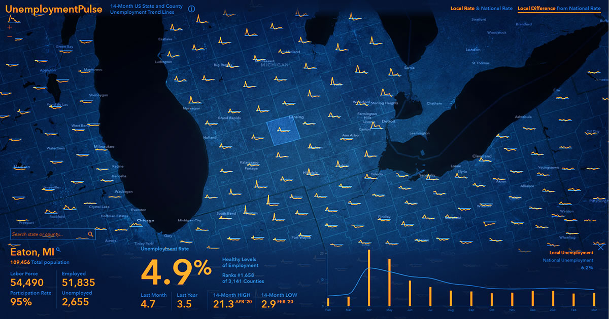

# Unempolyment Pulse

[UnemploymentPulse](https://livingatlas.arcgis.com/unemploymentpulse/#fips=&@=-95.973,37.735,4) visualizes a moving 14-month window of unemployment data at the state and county level, as reported by the Bureau of Labor and Statistics (monthly report, generally released with about a six-week lag). Local rates are shown alongside national rates.

[view it live](https://livingatlas.arcgis.com/unemploymentpulse/#fips=&@=-95.973,37.735,4)


## Getting Started

- To begin, clone this repository to your computer:

    ```sh
    https://github.com/vannizhang/unemployment-pulse.git
    ```

- From the project's root directory, install the required packages (dependencies):

    ```sh
    npm install
    ```

- Now you can start the webpack dev server to test the app on your local machine:

    ```sh
    # it will start a server instance and begin listening for connections from localhost on port 8080
    npm run start
    ```

- To build/deploye the app, you can simply run:

    ```sh
    # it will place all files needed for deployment into the /dist directory 
    npm run build

## FAQ

- How to generate [data](./public) for sparklines?

    > use `npm run download-data` command to fetch Unemployment data and transform them into the JSON files with paths that can be rendered as sparklines.

## Resources
- [Introducing UnemploymentPulse](https://www.esri.com/arcgis-blog/products/arcgis-living-atlas/mapping/unemployment-pulse/)
- [BLS-related resources in Living Atlas](https://livingatlas.arcgis.com/en/browse/#d=2&q=Bureau%20of%20Labor%20Statistics)
- [How to create a sparkline map](https://www.esri.com/arcgis-blog/products/js-api-arcgis/mapping/how-to-create-a-sparkline-map-with-the-arcgis-api-for-javascript/)

## Issues

Find a bug or want to request a new feature?  Please let us know by submitting an issue.

## Contributing

Esri welcomes contributions from anyone and everyone. Please see our [guidelines for contributing](https://github.com/esri/contributing).

## Licensing
Copyright 2020 Esri

Licensed under the Apache License, Version 2.0 (the "License");
you may not use this file except in compliance with the License.
You may obtain a copy of the License at

   http://www.apache.org/licenses/LICENSE-2.0

Unless required by applicable law or agreed to in writing, software
distributed under the License is distributed on an "AS IS" BASIS,
WITHOUT WARRANTIES OR CONDITIONS OF ANY KIND, either express or implied.
See the License for the specific language governing permissions and
limitations under the License.

A copy of the license is available in the repository's [LICENSE](LICENSE) file.